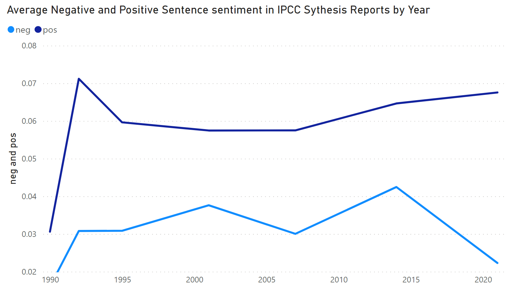

# Has the sentiment of the IPCC Climate change report quantifiably changed over the reports 7 reports since 1995?

Preliminary analysis says...no:

To use, download the synthesis (or full) reports from this link and place them a folder named IPCC_Reports with each report named with the year in the title. 

*resources used:*
- <a href = 'https://towardsdatascience.com/natural-language-generation-part-2-gpt-2-and-huggingface-f3acb35bc86a'>how to make Training data with scikit learn</a>
- <a href='https://huggingface.co/course/chapter3/3?fw=pt'>hugging face fine-tuning Docs</a>

files in this repo use the `#%%` comment to separate workbook cells. 
TODO:

- [ ] add requirements.txt file
- [ ] make a climate doom twitterbot :smile:
- [ ] make a :huggingface: readme section
-